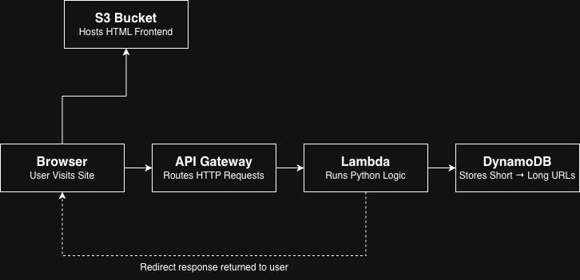
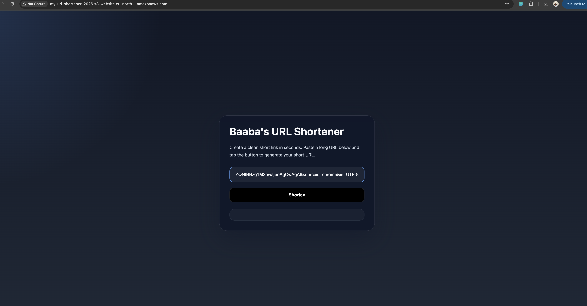
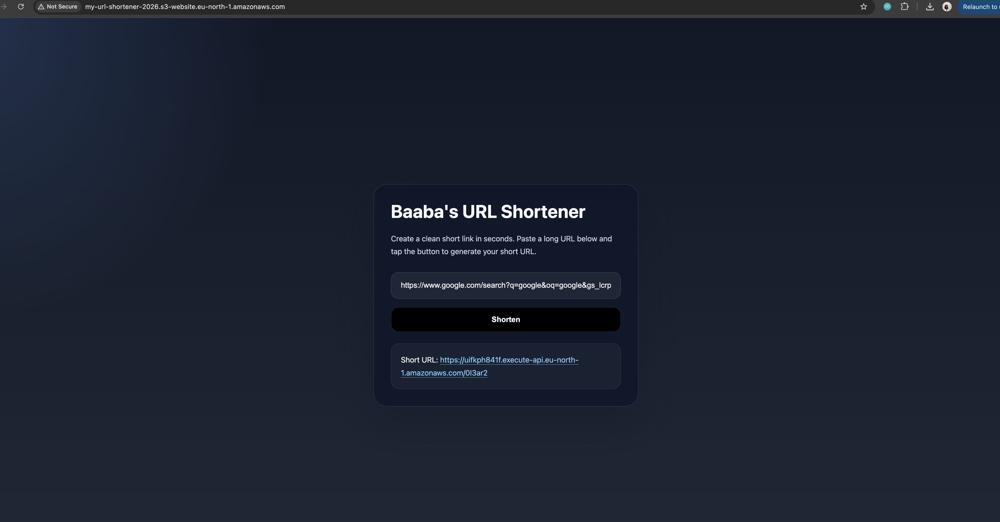

# Baaba's Serverless URL Shortener

A fully serverless URL shortener built on AWS — no traditional server required.
Paste any long URL and get a short link instantly. Built as part of my AWS cloud learning journey.

🔗 **Live site:** [http://my-url-shortener-2026.s3-website.eu-north-1.amazonaws.com/]

---

## Architecture

Example:

The app is made up of 4 AWS services working together:

- **S3** — hosts the static HTML frontend
- **API Gateway** — exposes two HTTP routes (`POST /shorten` and `GET /{short_code}`)
- **Lambda (Python)** — serverless functions that handle creating and resolving short URLs
- **DynamoDB** — NoSQL database storing the mapping of short codes to original URLs

---

## How it works

1. User visits the frontend hosted on S3
2. They paste a long URL and click Shorten
3. The frontend sends a `POST` request to API Gateway
4. API Gateway triggers the `create-short-url` Lambda function
5. Lambda generates a random 6-character code and saves it to DynamoDB
6. The short URL is returned and displayed to the user
7. When someone visits the short URL, API Gateway triggers `redirect-url` Lambda
8. Lambda looks up the code in DynamoDB and redirects to the original URL

---

## AWS Services Used

| Service | Purpose |
|---|---|
| S3 | Static website hosting |
| API Gateway | HTTP API routing |
| Lambda | Serverless compute (Python 3.12) |
| DynamoDB | Key-value storage |

---

## What I learned

- How to build a fully serverless architecture on AWS
- Connecting API Gateway routes to Lambda functions
- Reading and writing to DynamoDB from Python using `boto3`
- Debugging and fixing CORS errors between a frontend and a cloud API
- Hosting a static website on S3 with public access policies

---
